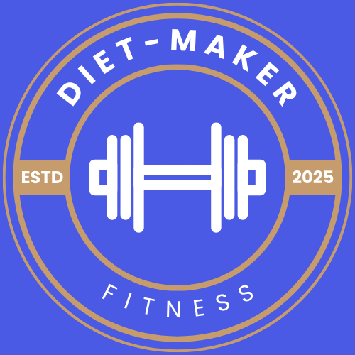

# ダイエットメーカー
### サービスURL : https://diet-maker.jp/

## **■サービス概要**

このサービスは、ユーザーの情報（質問）をもとに、ニーズにあった筋トレメニューを提案したり、体重やカロリーを記録して管理できたりと、ダイエットのサポートを目的としたサービス

➡️ [アプリ使い方はこちら（動画あり）](https://diet-maker.jp/app-usage)🔗
*（新しいタブで開くには、リンクを右クリックして「新しいタブで開く」を選択してください）*

## **■このサービスへの思い・作りたい理由**

- 元々は筋トレメニューや結果などをノートに記載して管理していましたが、フィットネスアプリの存在を知り、アプリを使って管理を始めた。
しかし使用していたアプリに対して、使い勝手が良くないと感じる箇所や、 この機能があったら使いやすいのになと思うことがあったため、
それを改善してシンプルで使いやすいアプリを作りたいと思ったから。
- 友人から筋トレのメニューを考えて欲しいとお願いされる機会が何度かあったため、アプリを作ってしまえば、アプリを教えるだけで、正しいメニューを提案できるから。
- 今後の長い人生において、筋トレを長期的にやっていきたいと考えているので、「ダイエットメーカー」を制作することで、筋トレを長期的に継続させる手助けになると思ったから。

## ■ ユーザー層について

- 筋トレ初心者
- ダイエットしたい方
- 運動を習慣にしたいのに習慣化できない方
- トレーニングの記録を管理したいトレーニー（中級者・上級者含む）
- 日々の体重の記録を管理したい方

## ■ サービスの利用イメージ

- （1）基礎代謝などを計算させるために、「性別」「身長」「体重」「年齢」などの基本情報を設定する。
- （2）「ダイエット心構え」の内容を確認して、ダイエットを継続させるためのマインドセットを理解する。
- （3）「目標体重」「目標達成日」を設定して、何kgいつまでに減量するのかを決める。
- （4）「性別」「ジムタイプ」「トレーニング頻度」「トレーニングボリューム」の情報を入力して、提案されたトレーニングメニューを保存し、実行する。
- （5）毎朝体重を測定し、その数値を記録する
- （6）「活動量」「1日の摂取カロリー」を入力、1日のカロリーの差分を把握して、総消費カロリーがマイナスになるように摂取カロリーを意識する。
- （7）アプリ内、Xに1日のトレーニングの記録やカロリー関係の記録などをシェアして、いいねをもらい習慣化できるまでのモチベーションを維持する。
- （8）他の人のよかった投稿や、自分の投稿にいいねをしてくれた人の投稿にいいねをつけて、継続的にいいねをもらいやすい状況を作りモチベーション低下を防ぐ。
※Xで「＃ダイエットメーカー」で検索して、「#ダイエットメーカー」が記載されている投稿にいいねするとより良い！

## ■ サービスの差別化ポイント・推しポイント

- **トレーニングメニューを自分で考えなくても無料で提案してくれる！**
※既存のフィットネスアプリだと、トレーニングメニューを提案してもらうとすると、有料プランになってしまう場合が多い。
- **いいなと思った人のトレーニングメニューを確認してコピーすることができる！**
- **体重を入力する画面にて、設定した目標体重や目標達成予定日までの残り日数が一目で確認できるため、目標を忘れることなく意識しやすい**
- **トレーニングの内容（種目や重量や回数など）を保存する機能がシンプルで使いやすい**
- **使用頻度の高い機能については、フッターから容易にアクセスできるように工夫してある**

## ■ 機能一覧
**<ログインが必要な機能>**
- (1) 目標設定機能
- (2) 基礎代謝を計算させる機能
- (3) 提案されたトレーニングメニューを保存する機能
- (4) トレーニングの内容（種目、重量、回数など）を保存する機能
- (5) 体重の記録を保存する機能
- (6) カロリー関係や歩数などを保存する機能
- (7) 選択した日付のトレーニングとカロリー関係の1日の成果を確認し、アプリ内で成果をシェアする機能
- (8) 投稿された人のトレーニングメニューをコピーする機能
- (9) 投稿された内容に対していいねをする機能

**<ログインがいらない機能>**
- (1) トレーニングメニューの提案機能（データの保存は不可）
- (2) みんなの投稿一覧画面の閲覧機能
- (3) みんなの投稿一覧で投稿された内容をXに投稿できる機能

**<その他>**
- ユーザー登録機能：ユーザー名とメールアドレス、Google認証の２種類で登録できます。
- パスワードリセット機能：パスワードを忘れた場合にリセットして再登録も可能です。
- お問い合わせ
- 利用規約
- プライバシーポリシー
- ダイエット心構えの内容を閲覧する機能
- アプリ使い方の内容を閲覧する機能

## ■ 技術スタック

| カテゴリー | 使用技術 |
| --- | --- |
| フロントエンド | React.js |
| バックエンド | Ruby on Rails (APIモード) |
| インフラ | Heroku ・ Vercel |
| DB | MySQL |

## 画面遷移図
Figma：https://www.figma.com/design/WHYWtAfrNAXS4hUamdMLvS/%E7%AD%8B%E3%83%88%E3%83%AC%E3%82%A2%E3%83%97%E3%83%AA%EF%BC%9A%E7%94%BB%E9%9D%A2%E9%81%B7%E7%A7%BB%E5%9B%B3?node-id=52-2&t=Bwa5jYzGkH9I5GGK-0
## ER図
https://app.diagrams.net/#G1namI6PokSsI6GDt_P3Ej5YoQyJNW3fS8#%7B%22pageId%22%3A%22R2lEEEUBdFMjLlhIrx00%22%7D

